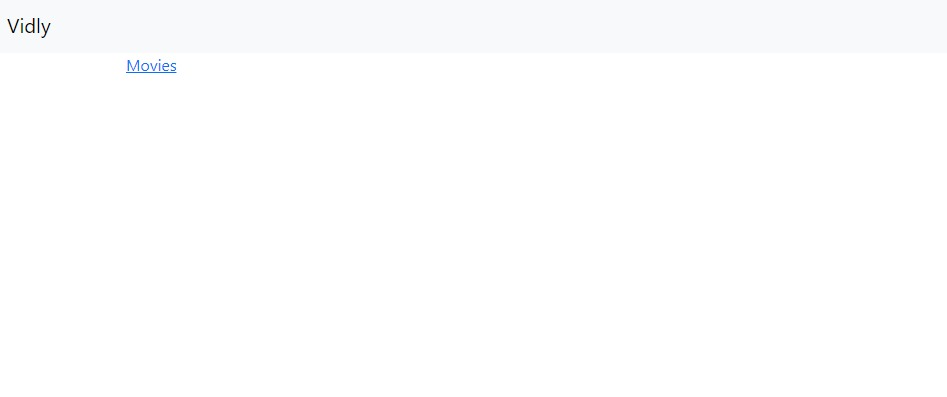
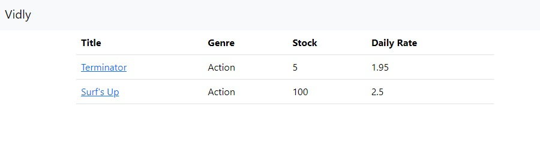
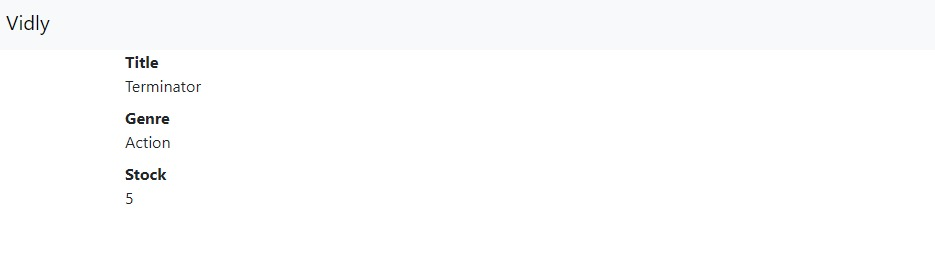
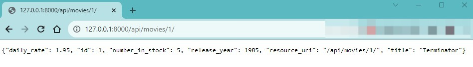

# Django WebApp
This is my first Django web application

# Features
This is a simple Django project where I learned about Django Html, referencing URLs, creating APPs, migrations, templates, models, admin page, etc... 

# Project Description
This project is about a movies store and has simple pages where you can se about movies and your informations such as it's genre, number of them in the "stock" and their daily rate for the shop

# Database
For the database I chose to use the sqlite3 database that's created by django since this is a very small project. 
Used the "models.py" in the movies app to create a class for the movies genre
```
class Genre(models.Model):
    # Genre Name
    name = models.CharField(max_length=255)

    # Specification for the admin page
    def __str__(self):
        return self.name
```
and a class for the movies it self

```
class Movie(models.Model):
    title = models.CharField(max_length=255)
    release_year = models.IntegerField()
    number_in_stock = models.IntegerField()
    daily_rate = models.FloatField()
    genre = models.ForeignKey(Genre, on_delete=models.CASCADE)
    date_created = models.DateTimeField(default=timezone.now)
```


# Templates

There are 3 main templates, but I created the "base.html" that has the navbar.

```
<html lang="en">
<head>
    <meta charset="UTF-8">
    <meta name="viewport" content="width=device-width, initial-scale=1.0">
    <link href="https://cdn.jsdelivr.net/npm/bootstrap@5.3.2/dist/css/bootstrap.min.css" rel="stylesheet" integrity="sha384-T3c6CoIi6uLrA9TneNEoa7RxnatzjcDSCmG1MXxSR1GAsXEV/Dwwykc2MPK8M2HN" crossorigin="anonymous">
    <title>Vidly</title>
</head>
<body>
    <nav class="navbar bg-body-tertiary">
        <div class="container-fluid">
          <a class="navbar-brand" href="/movies">Vidly</a>
        </div>
      </nav>
    <main class="container"> 
        
        
    </main>
</body>
</html>
```

Now the 3 main pages:
The home page:
It just extends the base and add a link to the movies page
```



    <a href=""> Movies </a>
    
```

The index page:
Here's where the movies are displayed
Here I use a for loop to iterate the Database for the movies informations
```



<table class="table">
    <thead>
        <tr>
            <th>Title</th>
            <th>Genre</th>
            <th>Stock</th>
            <th>Daily Rate</th>
        </tr>
    </thead>
    <tbody>
        
        <tr>
            <td>
                <a href="">
                {{ movie.title }}
                </a>
            </td>
            <td>{{ movie.genre}}</td>
            <td>{{ movie.number_in_stock }}</td>
            <td>{{ movie.daily_rate }}</td>
        </tr>
        
    </tbody>
</table>

```

And finally a page called "detailed"
That Page is basically the same as the index but the informations are displayed in other way

```



    <dl>
        <dt>Title</dt>
        <dd>{{ movie.title }}</dd>
        <dt>Genre</dt>
        <dd>{{ movie.genre }}</dd>
        <dt>Stock</dt>
        <dd>{{ movie.number_in_stock }}</dd>
    </dl>

```

And now a picture for the respective pages:

## **Home** 
 


## **Index** 
 

## **Details** 
 

# Api


There's a app called "api" where I get the database informations and put them in a json format and people can access through the "/api/movies/id" url and use it

```
from django.db import models
from tastypie.resources import ModelResource
from movies.models import Movie

class MovieResource(ModelResource):
    class Meta:
        queryset = Movie.objects.all()
        resource_name = 'movies'
        excludes = ['date_created']
```

## **Api** 
 